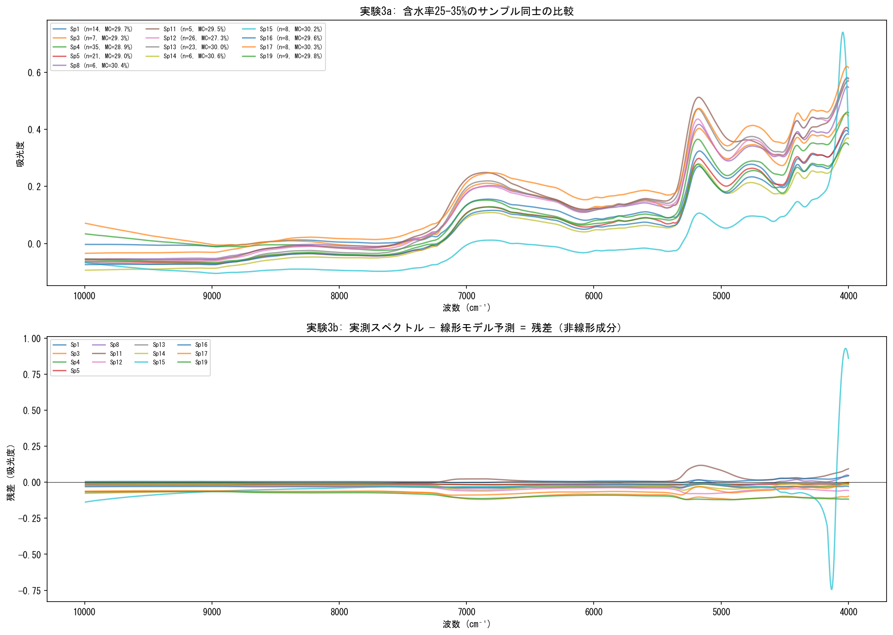
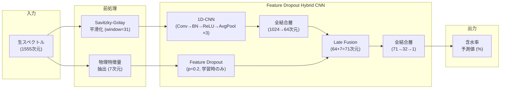
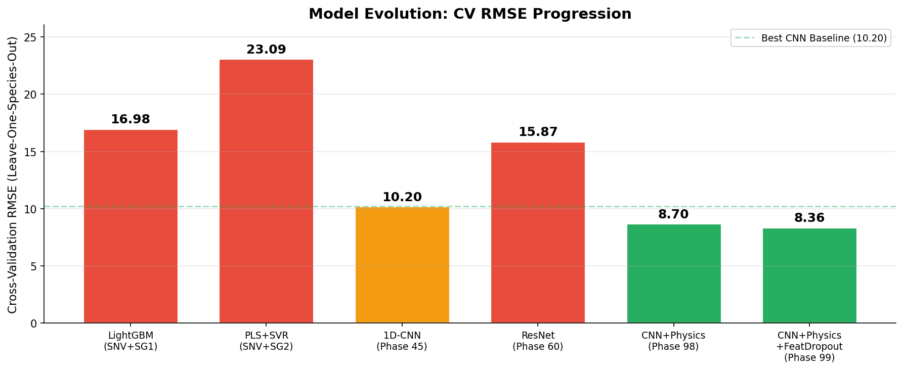
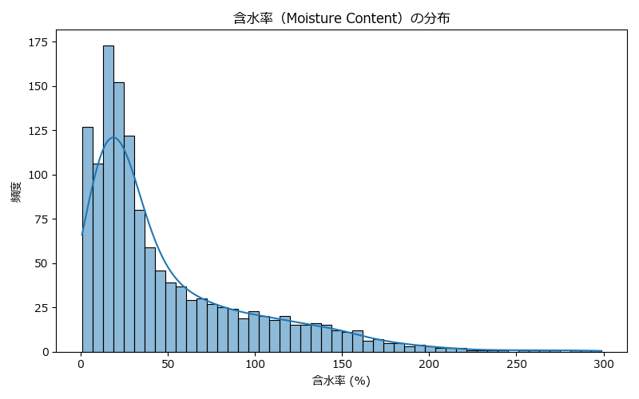
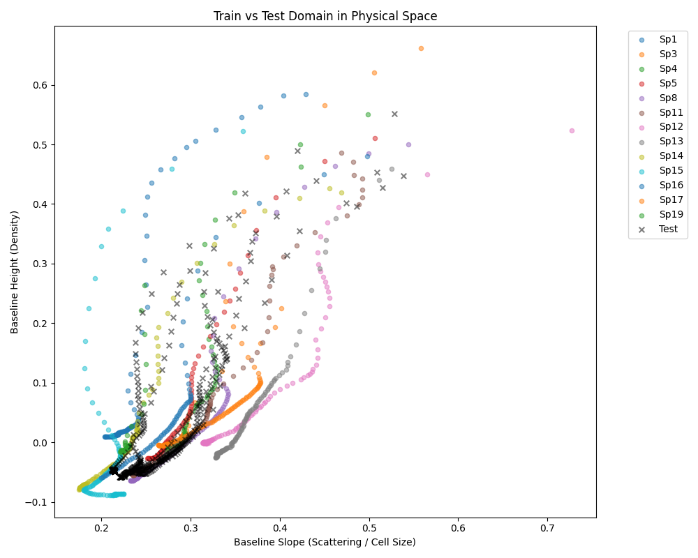
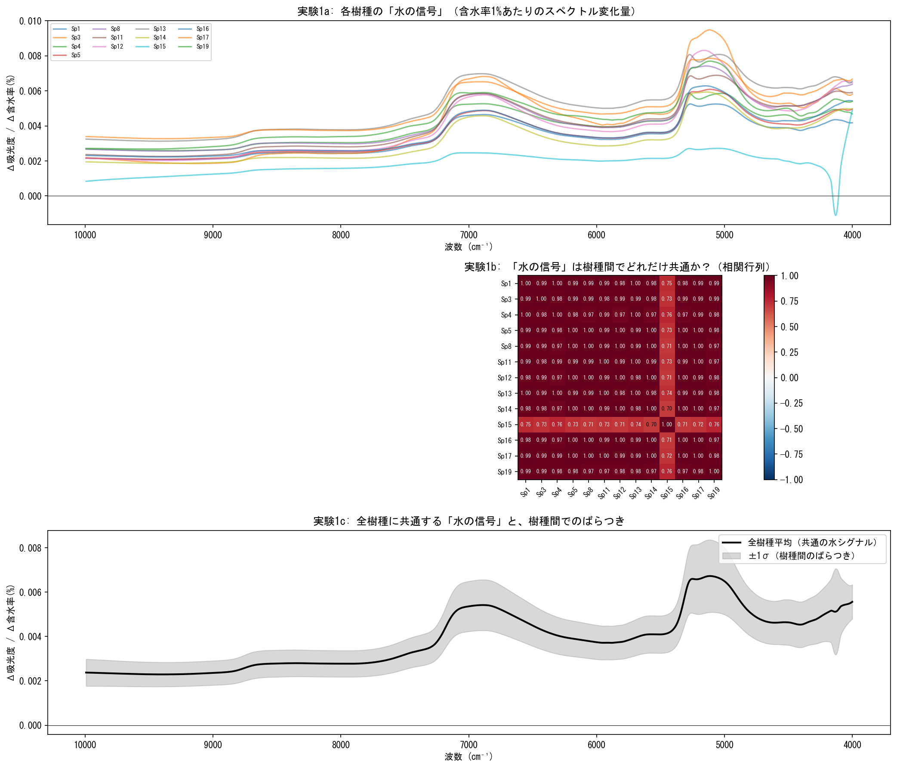

# 🌲 近赤外分光スペクトルを用いた木材含水率のロバスト予測

> **コンペティション規約により、実行可能なソースコード・学習済みモデル・データセットは本リポジトリに含まれていません。**
> 解法の思考過程・アーキテクチャ設計・EDA結果のみを公開しています。

---

## 目次
1. [背景と課題設定](#1-背景と課題設定)
2. [データの構造](#2-データの構造)
3. [最終モデルの全体像](#3-最終モデルの全体像)
4. [特徴量の設計](#4-特徴量の設計)
5. [モデルアーキテクチャの詳細](#5-モデルアーキテクチャの詳細)
6. [精度（RMSE）の推移](#6-精度rmseの推移)
7. [実験中の重要論点と決断](#7-実験中の重要論点と決断)
8. [EDA（探索的データ分析）ギャラリー](#8-eda探索的データ分析ギャラリー)

---

## 1. 背景と課題設定

### 近赤外分光法（NIR）とは
木材に近赤外線を照射し、反射光のスペクトル（波長ごとの吸光度）を測定する**非破壊検査技術**です。
木材中の水分子（O-H結合）は特定の波長で光を吸収するため、スペクトルの形状から含水率を推定できます。

### コンペティションの課題
近赤外スペクトル（1555波長点の吸光度ベクトル）を入力とし、木材の含水率（%）を回帰予測するモデルを構築します。

### 最大の難所：ドメインシフト（未知樹種への汎化）
本コンペの最大の特徴は、**学習データと評価データで「樹種」が完全に異なる**ことです。

| | 学習データ (Train) | 評価データ (Test) |
|---|---|---|
| サンプル数 | 1,322件 | 476件 |
| 樹種 | Sp1, 3, 4, 5, 8, 11, 12, 13, 14, 15, 16, 17, 19 (13種) | Sp2, 6, 7, 9, 10, 18, 20 (7種) |
| 共通樹種 | **なし（0種）** | **なし（0種）** |

つまり、「イチョウやスギで学習したモデルで、見たことのないケヤキやブナの含水率を当てろ」という、極めて過酷な**ゼロショット汎化**タスクです。


*樹種ごとの近赤外スペクトル。同じ含水率でも、木材の密度や細胞構造の違いによりベースライン（Y軸全体の高さ）やピーク形状が大きく異なる。*

---

## 2. データの構造

### スペクトルに混在する3つの情報

近赤外スペクトルの各波長点には、以下の3つの情報が**不可分に混在**しています。

| 情報 | 内容 | 含水率との関係 |
|---|---|---|
| **A. 水分シグナル** | O-H結合の吸収（5150 cm⁻¹, 6900 cm⁻¹付近） | 含水率に比例してピークが増大 |
| **B. 木材の密度・構造** | 光の散乱によるベースラインのシフト・傾き | 全波長に均一に影響。樹種固有。 |
| **C. 木材の化学成分** | セルロース・リグニン等の吸収帯 | 樹種の「指紋」。含水率とは無関係。 |

### なぜ単純なピーク抽出では解けないのか

含水率（%）は **水の質量 ÷ 乾燥木材の質量 × 100** で定義されます。一方、NIRスペクトルの吸光度は **水の体積濃度 × 光路長** に比例します（ランベルト・ベールの法則）。

この「質量比 vs 体積濃度」のズレにより、**同じ含水率30%でも密度の高い木（ナラ）と低い木（スギ）ではスペクトルの見え方が全く異なる**という根本的な問題が発生します。


*同じ含水率帯（25-35%）のサンプルでも、樹種によりベースラインが10倍以上異なる。*

---

## 3. 最終モデルの全体像

以下のフローチャートが最終モデル（Feature Dropout Hybrid CNN）の全体像です。



### 設計思想

1. **波形のテクスチャ（局所的な形状変化）** は1D-CNNが自動抽出する
2. **マクロな物理量（ピークの高さ・面積・ベースライン）** は人間が分光学の知見から手動設計する
3. この2系統を**ネットワークの深層（64次元まで圧縮した段階）**で結合する（Late Fusion）
4. 物理特徴量側に**Feature Dropout (20%)**を適用し、CNNが物理特徴量に依存して「サボる」ことを防止する

---

## 4. 特徴量の設計

### 4.1 ベース入力（波形特徴量）

| 特徴量 | 説明 | 次元数 |
|---|---|---|
| SG平滑化スペクトル (SG0) | Savitzky-Golay フィルタ (window=31, poly=3) で高周波ノイズを除去した吸光度スペクトル | 1555 |

### 4.2 手作り物理特徴量（7次元）

分光学の知見から、以下の7つの特徴量を独自に設計しました。全てベースライン補正（2点法：左右のショルダーを結んだ直線を差し引く）を適用しています。

| # | 特徴量名 | 定義 | 物理的意味 |
|---|---|---|---|
| 1 | `A5150` | 5150 cm⁻¹でのベースライン補正済み吸光度（ショルダー: 4000, 7500） | O-H結合の結合音。**水分量の最も直接的な指標**。乾燥材でのマイナス化を防ぐため `clip(0, None)` を適用。 |
| 2 | `A6900` | 6900 cm⁻¹でのベースライン補正済み吸光度（ショルダー: 6000, 7500） | O-H結合の第1倍音。水分量の補助的な指標。 |
| 3 | `Ratio_6900` | `A5150 / (A6900 + 1e-8)` | 2つの水の吸収帯の比率。水分子の結合状態（自由水 vs 結合水）の推定に使用。 |
| 4 | `Width_5150` | `Area5150 / max(0.01, A5150)` | 5150 cm⁻¹ピークの面積をピーク高さで正規化した「見かけの幅」。水分子の存在環境の多様性を反映。分母のクランプでスケール爆発を防止。 |
| 5 | `Peak_W` | 5000-5400 cm⁻¹の範囲で吸光度が最大となる波数位置 | ピーク位置のシフト。水分子と木材成分の相互作用の強さを反映。 |
| 6 | `Good_Baseline` | 7000-8000 cm⁻¹ の中央値 | 水の吸収がほぼゼロの安定した波数帯における吸光度。**木材の密度・散乱特性のプロキシ**。 |
| 7 | `Baseline_Drop` | `A(7500) - A(9000)` | ベースラインの傾き（差分）。光散乱の波長依存性を反映し、木材の表面粗さや粒子径の情報を担う。 |

---

## 5. モデルアーキテクチャの詳細

### 5.1 1D-CNN ブロック

| レイヤー | 出力チャネル | カーネルサイズ | ストライド | プーリング | 備考 |
|---|---|---|---|---|---|
| Conv1d + BN + ReLU | 16 | 11 | 2 | AvgPool1d(2) | 広いカーネルで大域的な吸収帯を捕捉 |
| Conv1d + BN + ReLU | 32 | 7 | 1 | AvgPool1d(2) | 中間的な波長パターンを抽出 |
| Conv1d + BN + ReLU | 64 | 5 | 1 | AdaptiveAvgPool1d(16) | 局所的なピーク形状を抽出 |

> **設計根拠（AvgPool の採用）**: 画像認識で一般的な MaxPool はスパイクノイズを拾いやすい。分光スペクトルでは吸光度の「面積（エネルギー総量）」が物理的に意味を持つため、面積情報を保存する AvgPool を全層で統一した。

> **設計根拠（極小キャパシティ 16→32→64）**: 学習データが1,322件と極めて少ないため、大規模なネットワーク（ResNet等）は即座にノイズを暗記してしまう。フィルター数を意図的に絞ること自体が、強力な構造的正則化として機能している。

### 5.2 Late Fusion と Feature Dropout

```
CNN出力 (64*16=1024次元) → FC層 (1024→64) → Dropout(0.3)
                                                    ↓
物理特徴量 (7次元) → Feature Dropout(0.2) ──→ Concat (64+7=71次元)
                                                    ↓
                                         FC層 (71→32) → Dropout(0.2) → 出力 (1)
```

> **Feature Dropout の設計根拠**: 物理特徴量を「常に完全な形で」モデルに渡すと、CNNは波形のテクスチャ学習をサボり、物理特徴量だけに頼った「ショートカット学習」を行う。学習時に20%の確率で物理特徴量の各次元をゼロにすることで、CNNが波形そのものから情報を抽出するよう強制した。

### 5.3 学習設定

| 項目 | 設定値 | 根拠 |
|---|---|---|
| ターゲット変換 | `√(含水率)` | 高含水率サンプルの勾配爆発を抑えつつ、低含水率のサボりを防ぐ「黄金比」 |
| 損失関数 | MSELoss | sqrt変換済みターゲットに対して適用 |
| オプティマイザ | Adam (lr=1e-3) | — |
| スケジューラ | CosineAnnealingLR (T_max=150) | 検証Lossのノイズに左右されず最後まで学習を継続 |
| Early Stopping | patience=25 | — |
| バッチサイズ | 32 | — |
| アンサンブル | 5シード × LeaveOneGroupOut | 樹種単位でバリデーション。未知樹種への汎化を直接評価。 |

---

## 6. 精度（RMSE）の推移

Leave-One-Species-Out Cross-Validation による RMSE の推移です。



| フェーズ | アプローチ | CV RMSE | 備考 |
|---|---|---|---|
| 初期 | LightGBM (SNV+SG1) | 16.98 | 非線形パターンマッチングによる初期ベースライン |
| 初期 | PLS+SVR (SNV+SG2) | 23.09 | 線形モデルの限界。樹種間でスペクトル形状と含水率の関係が反転する問題を吸収できず。 |
| Phase 45 | **1D-CNN (波形のみ)** | **10.20** | CNNが波形テクスチャから樹種非依存の特徴を自動抽出。大幅な飛躍。 |
| Phase 60 | 1D-ResNet | 15.87 | 表現力の増加がマジョリティ樹種への過学習を招き、マイノリティ樹種で崩壊。 |
| Phase 98 | CNN + 物理特徴量 | 8.70 | CV上は改善したが、物理特徴量のショートカット学習が発生（後述）。 |
| Phase 99 | **CNN + 物理特徴量 + Feature Dropout** | **8.36** | Feature Dropoutにより、未知樹種Sp3/Sp11のRMSEが12.76→9.93、10.71→9.71に劇的改善。 |

---

## 7. 実験中の重要論点と決断

### 論点1：ResNetの失敗 ― なぜ「表現力を上げる」と悪化したのか

**問題**: Phase 45の1D-CNNをResNet（残差接続付き）に置き換えたところ、CV 10.20 → 15.87 に大幅悪化した。

**分析**: 学習データ1,322件のうち、特定の樹種（Sp12: トチ）が183件を占める一方、Sp19（ホワイトオーク）は51件しかない。ResNetの高い表現力はマジョリティ樹種の波形パターンを完璧に暗記してしまい、マイノリティ樹種に対して RMSE 20〜28 という大崩壊を引き起こした。

**決断**: 表現力を上げるのではなく、**極小のフィルター数（16→32→64）を維持し、ネットワークの「小ささ」自体を正則化として活用する**方針を採用した。

### 論点2：物理特徴量のショートカット学習 ― モデルは「何を見ていたのか」

**問題**: 物理特徴量（A5150, Good_Baseline等）をCNNに追加したところ、CVは8.70に改善したが、Public LBでは13.9に悪化した。

**分析**: EDAにより、学習データの特定の樹種では「Good_Baselineの値」と「含水率」にほぼ完全な相関（r=0.98）が存在することを発見。モデルは波形のテクスチャを学習するのをサボり、物理特徴量の値から「この値域はSp12（トチ）だから含水率はXX%だ」というショートカット（丸暗記）を行っていた。未知の樹種ではこの対応関係が成立しないため、予測が崩壊した。


*物理特徴量の値域が樹種ごとに明確に分離しており、モデルが樹種IDとして丸暗記してしまう原因となった。*

**決断**: 物理特徴量自体を排除するのではなく、**Feature Dropout (20%)** を適用して「学習時に物理特徴量の一部を意図的に見えなくする」ことで、CNNに波形テクスチャの学習を強制した。結果、未知樹種Sp3のRMSEが12.76→9.93（22%改善）、Sp11が10.71→9.71（9%改善）と劇的に改善した。

### 論点3：ターゲット変換の選択 ― なぜ `√(y)` が最適なのか

**問題**: 含水率の値域は 0〜150% と広く、高含水率サンプルの二乗誤差がオプティマイザの勾配を支配してしまう。

**比較検証**:
- `log1p(y)`: 高含水率の勾配を抑えすぎた結果、モデルが低含水率のマイノリティ樹種の学習を「サボる」ようになり、CV 15〜30 に崩壊。
- `Log-Cosh Loss`: 同様にマイノリティ樹種の学習が放棄される。
- **`√(y)`**: 勾配の爆発を抑えつつ、マイノリティ樹種のエラーにも十分なペナルティを与える「絶妙なバランス」として機能した。

**決断**: `√(y)` 変換 + MSELoss を全フェーズで統一的に採用した。

### 論点4：学習率スケジューラの選択

**問題**: Leave-One-Species-Out CVでは、各Foldのバリデーションセットが1樹種分（数件〜十数件）しかなく、バリデーションLossが毎エポック激しく振動する。

**分析**: `ReduceLROnPlateau` はこの振動を「学習の停滞」と誤認し、序盤（20エポック付近）で学習を打ち切ってしまった。

**決断**: バリデーションLossの値を一切参照せず、最終エポックまで強制的に学習を継続する **CosineAnnealingLR** を採用した。

---

## 8. EDA（探索的データ分析）ギャラリー

本プロジェクトで実施した主要なEDA結果の一部を掲載します。

### 含水率の分布

*含水率の値域は0〜150%超と極めて広い。高含水率のサンプルが少数のマイノリティ樹種に偏っている。*

### 学習データとテストデータの分布差

*学習データ（Train）とテストデータ（Test）のスペクトル分布。樹種の完全な不一致により、テストデータが学習データの分布外に位置している。*

### 水分子の吸収シグナル

*含水率の高いサンプルほど5150 cm⁻¹付近の吸収ピークが顕著になる。ただし、ベースラインの高さが樹種依存であるため、単純なピーク値の比較では樹種間の含水率比較ができない。*
