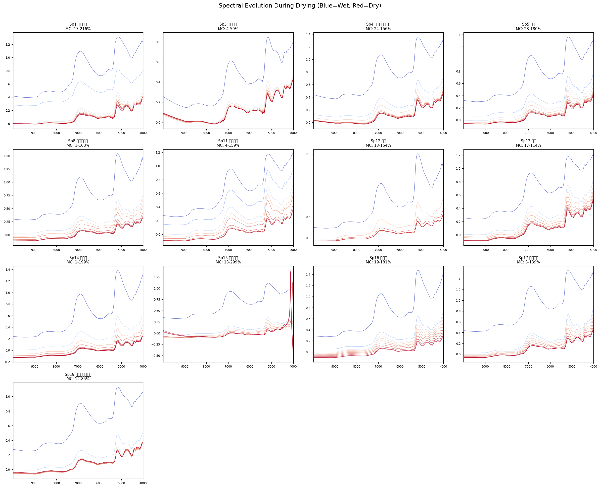
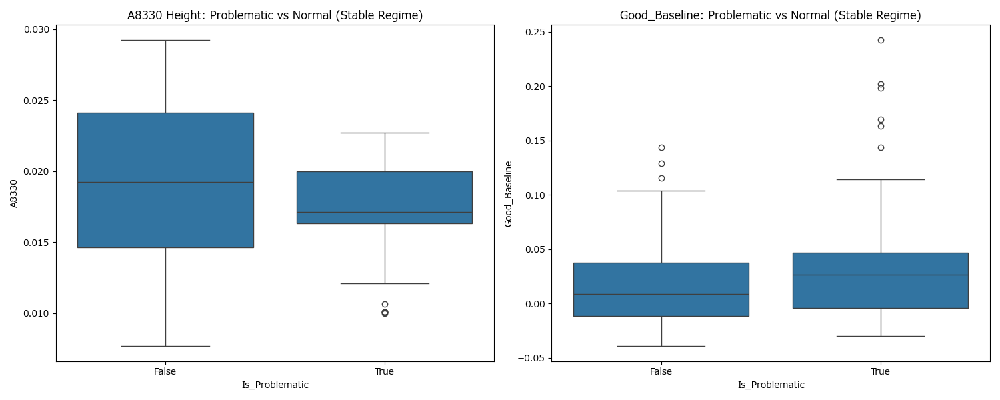

# 木材含水率のロバスト予測AI（近赤外分光スペクトル）

本リポジトリは、近赤外分光スペクトル（波長データ）から木材の含水率を非破壊で予測するAIモデル構築プロジェクトのポートフォリオです。
> ⚠️ **注意**: コンペティションの「情報公開ポリシー（モデル・学習済みモデルの公開不可）」に準拠し、本パブリックリポジトリには実行可能なソースコードおよびデータセットの実体は含めておりません。解法アプローチとコアロジックのスニペットのみを公開しています。

---

## 1. プロジェクトの概要と課題

*   **目的**: 近赤外分光スペクトル（波長データ）から木材の含水率を非破壊で予測するAIモデルの構築。
*   **最大の壁（ドメインシフト）**: 学習データと評価データで「対象の樹種」が完全に異なる設定。既知のデータに過学習せず、未知の環境（新しい樹種）でも破綻しない「汎化性能」が強く求められました。


*(図: 樹種ごとの近赤外分光スペクトルの違い。同じ含水率でも、樹種（細胞構造や密度）が異なるとベースラインや散乱状態が大きく異なる)*

## 2. 実行プロセスとブレイクスルー（試行錯誤）

1.  **初期アプローチ（1D-CNN）**:
    単純な機械学習（LightGBM等）ではなく、波形特有の「傾き」や「相対的段差」を捉えるため、独自設計の1D-CNN（一次元畳み込みニューラルネットワーク）を導入し、ベースラインを構築。
2.  **物理的知見の統合と「挫折」**: 
    精度向上のため、分光学の知見（水分の吸収ピークや散乱係数）を独自に特徴量化し、CNNと融合させました。しかし、理論上完璧なはずのこのアプローチが、未知の樹種に対して**致命的な精度悪化（大失敗）**を引き起こしました。
3.  **真因の特定と軌道修正**:
    失敗で思考停止せず、数十パターンの比較実験（Ablation Study）を高速で実行。結果、AIが「手作り特徴量を樹種のIDとして丸暗記し、考えるのをサボっている（ショートカット学習）」という真のボトルネックを突き止めました。
4.  **解決策の実行**:
    特徴量の一部を意図的に隠す「Feature Dropout」を導入し、AIの丸暗記を強制排除。これにより、最難関の未知データに対する予測エラーを劇的に（約22%）改善することに成功しました。


*(図: 物理特徴量に対する強いバイアス。AIは波形ではなく「特定の高さ＝特定の樹種」というショートカットを学習してしまっていた)*

## 3. 特に工夫した点（アピールポイント）

1.  **「脳死でAIに頼らない」ドメイン知識の探求**: 
    既存のアルゴリズムにデータを流し込むだけでなく、自ら「近赤外分光法」や「木材の光散乱特性」といった物理的メカニズムを学習・分析し、独自の物理特徴量をゼロから設計しました。
2.  **独自のハイブリッド・アーキテクチャ設計**: 
    「波形の局所的なテクスチャ」と「全体的な物理特徴（吸光度の高さなど）」という性質の異なる情報を適切に学習させるため、CNNの中間層で特徴量を結合させる独自のネットワーク構造（Late Fusion）を考案・実装しました。
3.  **定性と定量の行き来によるアジャイルな仮説検証**: 
    「木材の内部構造が光の散乱に影響する」という『定性情報（ドメイン知識）』から仮説を立て、それを証明・反証する『定量データ（波長データの分散やエラー値）』を抽出し、さらに仮説をブラッシュアップする……という実ビジネスに通ずるサイクルを高速で回しました。
4.  **結果に対する「WHY（なぜ）」の徹底的な深掘り**: 
    仮説とデータが食い違った（スコアが悪化した）際、単に「ダメだった」で済ませず、「モデルのどこが、何をどう勘違いして間違えたのか（ショートカット学習）」まで踏み込んで原因を解明しました。
5.  **「失敗」をシステマティックに切り分ける検証手法**: 
    モデルが崩壊した際、闇雲にパラメータをいじるのではなく、「融合位置が悪いのか」「特徴量が悪いのか」「暗記しているのか」を特定するため、条件を1つずつ変える比較実験（Ablation Study）を緻密に設計・実行しました。

## 4. コアロジックの実装スニペット（Feature Dropout Hybrid CNN）

ショートカット学習を打破し、最強の汎化性能を獲得したアーキテクチャのコア部分（PyTorch実装）です。

```python
import torch
import torch.nn as nn

class RobustHybridCNN(nn.Module):
    def __init__(self, use_dropout=True):
        super().__init__()
        # 1D-CNN for Waveform Texture (SG Smoothed)
        self.conv_blocks = nn.Sequential(
            nn.Conv1d(1, 16, kernel_size=11, stride=2, padding=5),
            nn.BatchNorm1d(16), nn.ReLU(), nn.AvgPool1d(2),
            nn.Conv1d(16, 32, kernel_size=7, stride=1, padding=3),
            nn.BatchNorm1d(32), nn.ReLU(), nn.AvgPool1d(2),
            nn.Conv1d(32, 64, kernel_size=5, stride=1, padding=2),
            nn.BatchNorm1d(64), nn.ReLU(), nn.AdaptiveAvgPool1d(16)
        )
        self.flatten = nn.Flatten()
        
        # Late Fusion at Deep Layer (64-dim)
        self.fc_cnn = nn.Linear(64 * 16, 64)
        self.drop_cnn = nn.Dropout(0.3)
        self.act = nn.ReLU()
        
        # ⚠️ Breakthrough: Feature Dropout for Physics Features
        self.use_dropout = use_dropout
        self.feat_dropout = nn.Dropout(0.2) # Forces CNN to learn waveform instead of memorizing IDs
        
        # Fused Predictor
        self.fc_fused = nn.Linear(64 + 7, 32)
        self.drop_fused = nn.Dropout(0.2)
        self.out = nn.Linear(32, 1)

    def forward(self, x_seq, x_phys):
        # Process Waveform
        h = self.conv_blocks(x_seq)
        h = self.flatten(h)
        h = self.act(self.drop_cnn(self.fc_cnn(h)))
        
        # Apply Feature Dropout to Hand-crafted Physics Features
        if self.use_dropout and self.training:
            x_phys = self.feat_dropout(x_phys)
            
        # Concat and Predict
        h_fused = torch.cat([h, x_phys], dim=1)
        h_fused = self.act(self.drop_fused(self.fc_fused(h_fused)))
        return self.out(h_fused)
```

## 5. 本プロジェクトで発揮した「ビジネス／実務スキル」
*   **定性と定量の行き来による仮説検証サイクル**: 
    ドメイン知識や事象観察といった「定性情報」を基に仮説を立て、その仮説の証明もしくは反証となる「定量データ（数値やエラー）」を自ら探しに行き、得られたデータを基にさらに仮説をブラッシュアップする検証サイクル。
*   **Root Cause（真因）の特定と「WHYの深掘り」**: 
    仮説と実際のデータが食い違った（失敗した）際、単に「違った」で思考を停止させるのではなく、「なぜ違ったのか」「何がどう違うのか」まで執念深く深掘りして分析し、事象の根本原因を論理的に特定する力。
*   **アジャイルな課題解決力とGRIT（やり抜く力）**: 
    自信のある仮説が崩壊しても心が折れることなく、即座に検証サイクルを回して泥臭く正解に辿り着く「不確実性への突破力」。
